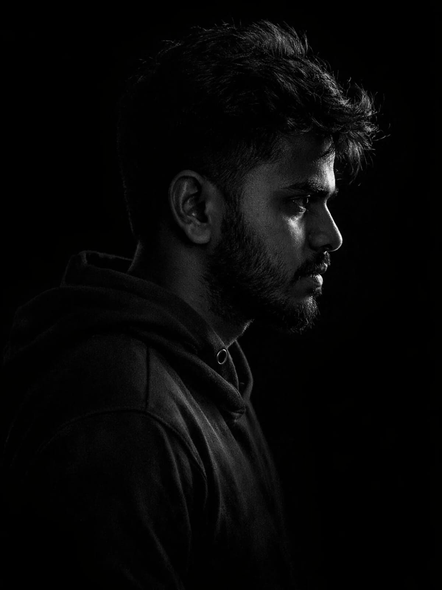

<div align="center">



<br/>


<br/>


[](https://nilavanan-fintech.github.io/nilavanan/)
[](mailto:nilavanan.sa@zohomail.in)
[](https://wa.me/918903645897)

</div>


## 🫒 About Me

```yaml
name: "Nilavanan S A"
role: "Business Intelligence & Full Stack Developer | Fintech-Focused Engineer"
current_focus: "Building smart, scalable systems for financial technology"
education: "MBA - Financial Management, Annamalai University (In Progress)"
background: "B.E Computer Science (Data Science), Annamalai University — OGPA 8.05"
based_in: "Chennai, Tamil Nadu, India"
mindset: "Merging financial acumen with backend engineering to build systems that scale"
```

<br/>

## 🌿 Tech Stack

<table align="center">
<tr>
<td align="center" width="140"><sub><b>LANGUAGES</b></sub></td>
<td>


</td>
</tr>
<tr>
<td align="center"><sub><b>BACKEND</b></sub></td>
<td>


</td>
</tr>
<tr>
<td align="center"><sub><b>FRONTEND</b></sub></td>
<td>


</td>
</tr>
<tr>
<td align="center"><sub><b>DATABASE</b></sub></td>
<td>

&nbsp;


</td>
</tr>
<tr>
<td align="center"><sub><b>TOOLS</b></sub></td>
<td>

&nbsp;
&nbsp;
&nbsp;


</td>
</tr>
</table>

<br/>

## 📊 GitHub Analytics

<div align="center">

<picture>
  
</picture>

<br/><br/>


<br/><br/>


</div>

<br/>

## 🚀 Featured Projects

<div align="center">

<a href="https://github.com/nilavanan-fintech/neobanks-vs-traditional-banks-comparison">

</a>


<br/><br/>


<br/><br/>


<br/><br/>

| Project | Focus |
|---|---|
| **[Neobanks vs Traditional Banks Comparison](https://github.com/nilavanan-fintech/neobanks-vs-traditional-banks-comparison)** | Fintech analysis comparing neobanks and traditional banks |
| **[Digital Payments & Consumer Behavior](https://github.com/nilavanan-fintech/digital-payments-consumer-behavior-analysis)** | UPI/BNPL impact on spending, saving & credit behavior in India |
| **[Robo-Advisory vs Traditional Wealth Management](https://github.com/nilavanan-fintech/robo-advisory-vs-traditional-wealth-management)** | Cost efficiency, returns & customer satisfaction comparison |
| **[Fintech Credit Risk (Alternative Data)](https://github.com/nilavanan-fintech/fintech-credit-risk-alternative-data)** | Alternative-data credit risk models vs traditional scoring |
| **[Financial Inclusion — Rural India](https://github.com/nilavanan-fintech/fintech-financial-inclusion-rural-india)** | Mobile banking, UPI & microfinance driving rural inclusion |
| **[Blockchain in Trade Finance](https://github.com/nilavanan-fintech/blockchain-trade-finance-banking)** | Blockchain applications in trade finance & cross-border banking |

</div>

<br/>

## 💼 Experience

<table>
<tr>
<td width="8" style="background-color:#606C38;"></td>
<td>

**Business Intelligence & Full Stack Developer** · Onsite `🟢 Current`
4D Advisory — *Jun 2026 – Present*

- **Task Tracker:** Developed a centralized platform for task assignment, progress monitoring, and project workflow management
- **KPI Dashboard:** Built a real-time performance tracking system to monitor employee productivity and business metrics

`Python` `Node.js` `GitHub` `cPanel` `VPS`

</td>
</tr>
<tr>
<td width="8" style="background-color:#606C38;"></td>
<td>

**Backend Developer & Business Analyst** · Contract
Tunelink Networks AI, Bengaluru — *Hybrid*

- Built backend systems using **Python** & **Node.js**
- Set up real-time monitoring dashboards with **Grafana**
- Deployed AI-powered voice automation using **Twilio**
- Managed **PostgreSQL** & **MySQL** with a focus on performance

`Python` `Node.js` `Grafana` `Twilio` `PostgreSQL`

</td>
</tr>
<tr>
<td width="8" style="background-color:#606C38;"></td>
<td>

**Backend Developer** · Intern
Mittai Healthcare Pvt Ltd

- Built AI-powered voice automation for business workflows
- Delivered real-time performance dashboards via **Grafana**

`Node.js` `Grafana` `Twilio` `FastAPI`

</td>
</tr>
<tr>
<td width="8" style="background-color:#606C38;"></td>
<td>

**IoT & Robotics** · Intern
Nissi Engineering Solutions, Chennai

- Implemented robotic systems using **Arduino**
- Hands-on sensor interfacing & embedded programming

`Arduino` `C++` `Embedded Systems`

</td>
</tr>
</table>

<br/>

## 🎓 Education

| Degree | Institution | Duration | Status |
|---|---|---|---|
| MBA — Financial Management | Annamalai University | 2025 – 2027 | 🟢 In Progress |
| B.E Computer Science (Data Science) | Annamalai University | 2021 – 2025 | ✅ OGPA: 8.05 |

<br/>

## 📡 Let's Connect

<div align="center">

[](https://nilavanan-fintech.github.io/nilavanan/)
[](mailto:nilavanan.sa@zohomail.in)
[](tel:+918903645897)
[](https://wa.me/918903645897)

</div>


<div align="center">
<sub>🫒 Built with code, powered by curiosity, driven by finance. 🫒</sub>
</div>
